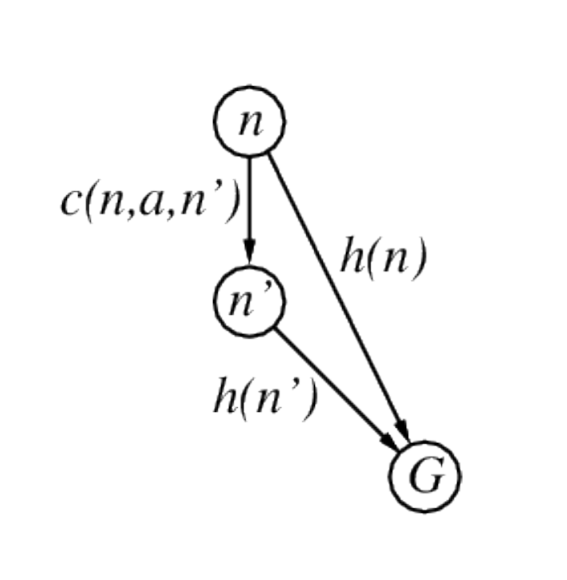

$$\underline{\textbf{Appunti: }\textit{Davide Fozzato} - \textit{Andrea Pellizzari}}$$

### Analisi della consegna pervenuta e assunzioni iniziali
Dalla specifica pervenuta mediante la consegna del progetto si nota che il dominio di riferimento dell'esame è quello del "Single state problem", dal momento che la soluzione per il nostro problema può essere vista come una sequenza di singole azioni, e che la funzione azione degli agenti ci porta da uno stato ad un altro stato. Alla luce di ciò, una soluzione al problema sarà chiaramente una sequenza di azioni (ci troviamo quindi in uno stato di mappa completa, deterministica), dunque l'agente atto alla risoluzione del problema definito nella specifica è un algoritmo di ricerca.

Ciò che preme ora specificare è la natura dell'algoritmo di ricerca che meglio si adatta al dominio di nostro interesse. Ricordiamo che per algoritmo di ricerca si intende la ricerca sistematica di un metodo di visita del grafo degli stati, a partire da un nodo iniziale fino a potenziali nodi terminali. Grazie alla schiera di algoritmi atti alla risoluzione di tali tipologie di problemi analizzati durante la trattazione del corso, siamo in grado di analizzare ognuna classe, in maniera tale da poter selezionare il più adatto per il dominio di riferimento

Il tema è quello di trovare soluzioni ai nostri problemi che siano compelti ma che dispongono di complessità sia sul tempo che sulle risorse rilevanti nel problema. Per completezza intendiamo la proprietà per cui l'albero di ricerca trova sempre una soluzione se essa esiste, nel dominio di riferimento, e dove con complessità temporale si intende il numero di nodi espansi, con complessità nello spazio il massimo numero di nodi che dobbiamo e con ottimalità il fatto che si garantisce di trovare la soluzione con costo minimo. La complessità in tempo e spazio è valutata mediante dei parametri:

• $b$: coefficiente massimo di ramificazione dell'albero di ricerca;

• $d$: profondità della soluzione a costo minimo;

• $m$: dimensione massima dello spazio degli stati (potenzialmente $\infty$);

### Analisi della classe di algoritmo che meglio raggiunge la soluzione del problema dato 
A questo punto analizziamo tutte le classi di algoritmo analizzate, in maniera da offrire una panoramica sulle caratteristiche ci hanno permesso di giungere alla conclusione della scelta finale dell'algoritmo da implementare per risolvere il problema dato (e dei rispettivi dettagli implementativi).

$\xrightarrow{\hspace{0.5cm}}$ **Ricerca non informata** mediante visita dello spazio degli stati: È da notare che la ricerca non informata è una strategia di ricerca che utilizza una visita che sfrutta solamente le informazioni fornite dal grafo degli stati. Tecniche come la Uniform-Cost-Search, e Iterative-Deeping-Search, sono quelle maggiormente applicate in i.a., in quest'ottica della ricerca. Dal punto di vista del nostro dominio, l'applicazione di una tale soluzione per il problema dato risulta essere "sub-ottimale". Infatti, gli algoritmi non informati esplorano lo spazio degli stati in modo radiale e il problema è che dato l'obiettivo del problema, una ricerca non informata sprecherà tempo ed energia computazionale esplorando situazioni (nel nostro caso celle), poiché non ha una "bussola" (l'euristica) che le indichi dove sia il goal. Da notare che il numero di nodi espansi cresce esponenzialmente rispetto alla profondità della soluzione, rendendo l'approccio inefficiente anche su una griglia 10x10 come la nostra. Dunque, dato che nel nostro problema vi è la caratteristica di "coordinate note", ignorare la posizione del goal risulterebbe errato, ciò che ci permette di considerare tale proprietà del problema è la ricerca informata.

$\xrightarrow{\hspace{0.5cm}}$ Nella **ricerca informata** disponiamo invece di ulteriori informazioni ulteriori su sottoinsiemi di nodi (potenzialmente equivalenti all'insieme di partenza) che arricchiscono gli stessi. Alcuni degli algoritmi che analizzeremo sono: Greedy Best-First search, $A^{\ast}$ search, Heuristics search. La definizione di base per la ricerca informata è quella di definire una funzione di valutazione definita per ogni nodo del grafo, che stima la "desiderabilità" del nodo fornito. Questa tecnica è detta "Best-First search", questa funzione rappresenta la informazione euristica (infatti la funzione sopracitata non rappresenterà una informazione certa e definita ma solamente una informazione euristica). La frontiera della visita verrà implementata come ordinata in ordine decrescente di desiderabilità . Vi sono due maggiori implementazioni effettive, ovvero la Greedy best-first search e $A^{\ast}$ search.

• Greedy best-first search: Questa tecnica si basa sulla valutazione della funzione $h(n)$: $$h(n) (heuristic) = \text{costo stimato da $n$ al goal più vicino}$$
Con parallelo all'esempio della ricerca interna alla mappa della Romania visto nella trattazione del corso, infatti, possiamo intendere la valutazione della funzione, come:$$h_{SLD}(n) = \text{linea retta che definisce la distanza da $n$ a Bucharest}$$
La Greedy search espande i nodi che "sembrano" essere i più vicini al goal (sulla
base della desiderabilità che dà l'indice di tale misurazione). È da notare, però, che la Greedy search non è completa, dal momento che può bloccarsi all'interno di loop. 

Analizziamo dunque se esistono altre soluzioni applicabili per il problema dato.

• $A^{\ast}$ search: L'algoritmo $A^{\ast}$ search è uno degli algoritmi di ricerca più utili nella disciplina della ricerca in domini single state (sopratutto informata). Grazie ad essa, al posto di ordinare la struttura dati per la esplorazione in base all'euristica (direttamente) effettuiamo ciò sulla base di una funzione $f(n)$, somma dei valori di costo ed euristica:
$$f(n) = g(n) + h(n)$$
dove gli elementi della precedente equazione sono esprimibili come:
- $g(n)$: costo al momento per raggiungere $n$;
- $h(n)$: costo stimato per il goal da $n$;
- $f(n)$: costo totale stimato per il percorso attraverso $n$ per il goal;

L'algoritmo $A^{\ast}$ search è completo, nel caso in cui il fattore di diramazione è finito (ogni nodo ha un numero finito di successori) e ciò si verifica per spazi degli stati di cardinalità finita come il nostro. La complessità nel tempo è esponenziale nel valore di (errore relativo a $h \times \text{lunghezza della soluzione}$). A partire da ciò, notiamo che la precisione dell'euristica si deve avvicinare il più possibile al valore del costo, così facendo si avrà un valore, dato dal prodotto, migliore. È da notare però che il valore dell'euristica non deve superare il costo reale, si tratta di una trade-off ben nota e studiata per situazioni di algoritmi di visita basati su euristica. La complessità nello spazio è pari alla totalità dei nodi (che vanno tenuti in memoria per la totalità dell'esecuzione). La ottimalità è garantita, per quanto detto precedentemente, sulla base delle assunzioni fatte sulle euristiche (ammissibilità e consistenza) e sulla search strategy (tree o graph search). Infatti $A^{\ast}$ è completo se si verifica, inoltre, la condizione per cui l'euristica è ammissibile (per completezza su spazi infiniti). Se i costi sono sempre positivi, come da assunzioni fatte nel nostro dominio, allora $A^{\ast}$ si comporta come una ricerca a costo uniforme e resta completo. Per le condizioni date nella consegna del progetto tali assunzioni si 

Infatti, visto quanto detto, $A^{\ast}$ search è pur sempre un algoritmo basato su euristica, gli algoritmi basati su euristica sono ottimali solo se un euristica è ammissibile ovvero se, per ogni nodo $h^{\ast}(n)$, non deve mai sovra-stimare la misura (nell'esempio precedente la distanza). Nota che la straight-line distance definita per l'esempio precedente, è ammissibile in quanto la distanza (definita concettualmente come "in linea d'aria") non sovrastimerà mai la misura della distanza, è utile riflettere che al massimo la sotto-stimerà. In algoritmi di ricerca basati su euristica le difficoltà dell'implementazione sono rappresentate in fase iniziale dalla individuazione di euristica ammissibile. Forniamo di seguito la formulazione matematica della ammissibilità. Una euristica è consistente, se dato un nodo ed un nodo suo successore, l'euristica del nodo $n$, deve essere inferiore al costo per arrivare al nodo successivo sommato al costo del nodo successore:
$$h(n) \leq c(n, a, n') + h(n')$$
notiamo che si tratta di una disuguaglianza triangolare, diamo una rappresentazione grafica di quanto rappresentato dai termini precedenti:

Dunque, possiamo dimostrare che, se $h$ è consistente, $f(n)$ è non decrescente lungo qualsiasi percorso. Dunque $A^{\ast}$ espande i nodi in ordine crescente di $f$, quindi troverà la soluzione con il costo minore.

Si può dimostrare dunque che se $A^{\ast}$ opera mediante una euristica, non capiterà mai nella visita di cercare di espandere un nodo con costo inferiore di nodi che ho già espanso. Di fatto, sulla base di questi presupposti è certo che $A^{\ast}$ trovi la soluzione di costo minimo, dal momento che se $h$ è consistente $f(n)$ è non decrescente indefinitamente in nessun cammino. Possiamo renderci conto di quanto detto, postulando la caratteristica di "monotona crescente" della funzione $c$ di costo. Per dimostrare quanto detta formuliamo:
$$g(n) + h(n) \leq g(n') + h(n')$$
allora
$$g(n) + h(n) \leq g(n) + c(n, a, n') + h(n')$$
Notiamo che tali formulazioni valgono a prescindere dal fatto che si tratti di tree- search o graph-search. È utile studiare ora la relazione che vige tra le due caratteristiche dell'euristica appena introdotte. Se una euristica è consistente allora è si verifica certamente la ammissibilità. Non vale, però, la impicazione inversa:
$$\text{consistenza} \Rightarrow \text{ammissibilità}$$
che può essere dimostrato per induzione sul percorso verso l'obiettivo, ed:
$$\text{ammissibilità} \not \Rightarrow \text{consistenza}$$
per la quale è sufficiente, infatti, trovare un controesempio.
Di conseguenza, alla luce dei fondamenti teorici per l'implementazione dell'algoritmo $A^{\ast}$ nel nostro dominio applicativo, se una soluzione esiste -e ciò si verifica certamente viste le ipotesi date nella specifica del progetto-, $A^{\ast}$ la troverà sempre.

## Spiegare il perchè la euristica verifica le condizioni date per la sua ammissibilità

## Spiegare la applicazione del graph-search e tree-search anche in legame alla euristica applicata